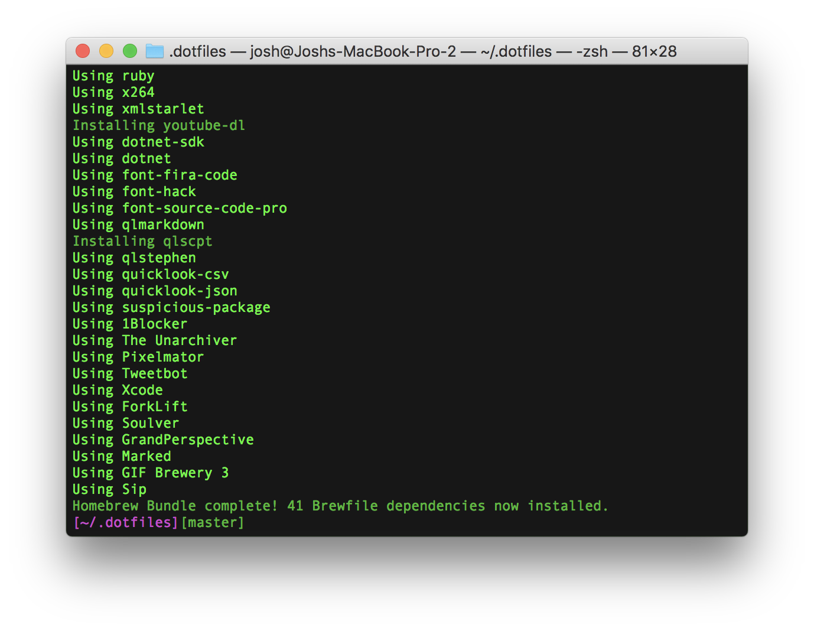
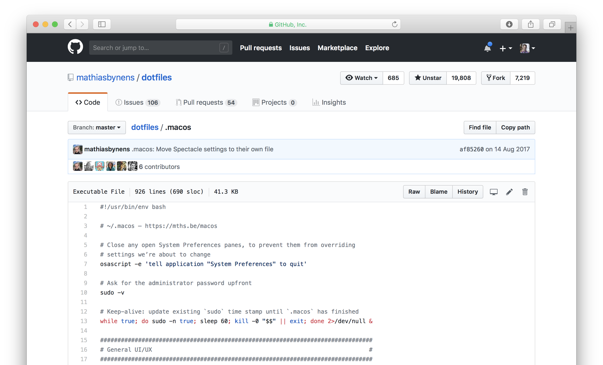
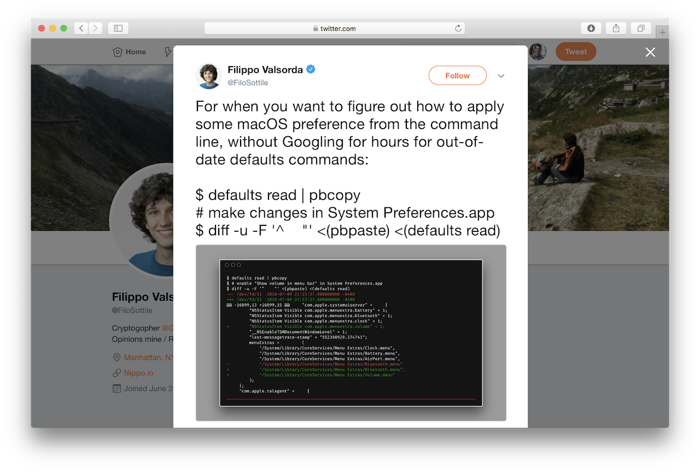

footer: Scripting your Mac setup – @joshparnham

^ I recently bought a new MacBook Pro and wanted to start fresh – here's my guide to maintaining the core your Mac configuration in code and automatically setting up your environment.

# Scripting your Mac setup 💻⚡️
[.hide-footer]

---

^ Link to my dotfiles repository, which contains my setup script and other configurations.

# 👉 https://github.com/josh-/dotfiles

---

## 🔴 Dotfiles

`gitignore`
`vimrm`
`zshrc`

---

## 🍻 Brewfile

^ Dotfiles and Dockerfiles are pretty cool these days, but I personally love a good Brewfile.

- Automate Homebrew depedencies

---

## Example `Brewfile`

^ You can install UNIX utilities, binary applications, fonts, and even Mac App Store apps.

```rb
tap 'homebrew/cask-fonts'

brew 'youtube-dl'

cask 'font-hack'

mas 'Xcode', id: 497799835
```

---

^ Installs the formula listed in the directory's Brewfile.

# `$ brew bundle`

---



---

## 🛠 Preferences

Adapted from Mathias Bynens' `.macos` script



---

## 🛠 Preferences

```
# Menu bar: show battery percentage
defaults write com.apple.menuextra.battery ShowPercent -string "YES"

# Menu bar: disable transparency
defaults write NSGlobalDomain AppleEnableMenuBarTransparency -bool false

```

---

## 🛠 Preferences

```
# Finder: show hidden files by default
defaults write com.apple.Finder AppleShowAllFiles -bool true

# Finder: show path bar
defaults write com.apple.finder ShowPathbar -bool true

# Avoid creating .DS_Store files on network or USB volumes
defaults write com.apple.desktopservices DSDontWriteNetworkStores -bool true
defaults write com.apple.desktopservices DSDontWriteUSBStores -bool true
```

---

## 🛠 Preferences

```
# Set double-click to stage file instead of opening in editor
defaults write com.torusknot.SourceTreeNotMAS fileDoubleClickBehaviour -int 1

# Set file filter status to sort by path alphabetically
defaults write com.torusknot.SourceTreeNotMAS fileStatusFilterMode -int 1

# Set staging view to split view
defaults write com.torusknot.SourceTreeNotMAS fileStatusStagingViewMode -int 1

# Disable tips
defaults write com.torusknot.SourceTreeNotMAS showStagingTip -bool false
defaults write com.torusknot.SourceTreeNotMAS showToolbarTip -bool false
```

---

## 🛠 Preferences

```
# Enable the "Do Not Disturb On/Off" keyboard shortcut
defaults write com.apple.symbolichotkeys.plist AppleSymbolicHotKeys -dict-add 175 "{
            enabled = 0;
            value =             {
                parameters =                 (
                    65535,
                    53,
                    262144
                );
                type = standard;
            };
        }"
```

---

## 🤔 How do I find these preferences?

```
$ defaults read > before.txt
```

_Do the things_

```
$ defaults read > after.txt
```

Diff & commit!

---

## 🤔 How do I find these preferences?

Credit to [@FiloSottile](https://twitter.com/FiloSottile/status/1016495719665020935):



---

# Thanks ✌️
[.hide-footer]
## @joshparnham

## github.com/josh-
